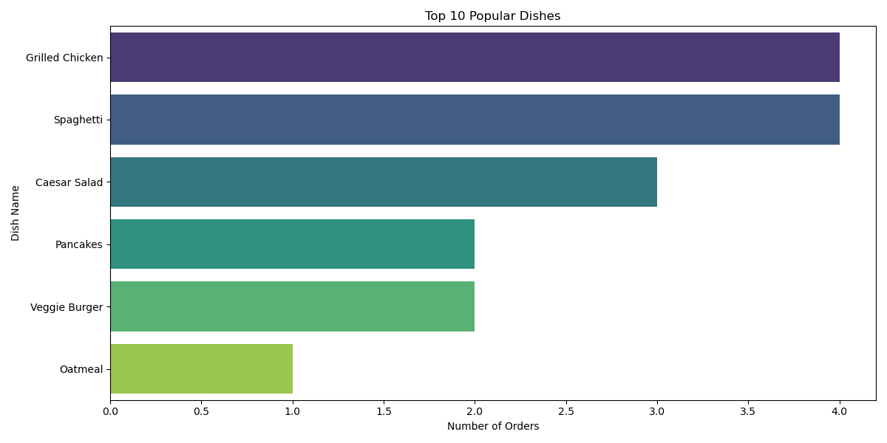
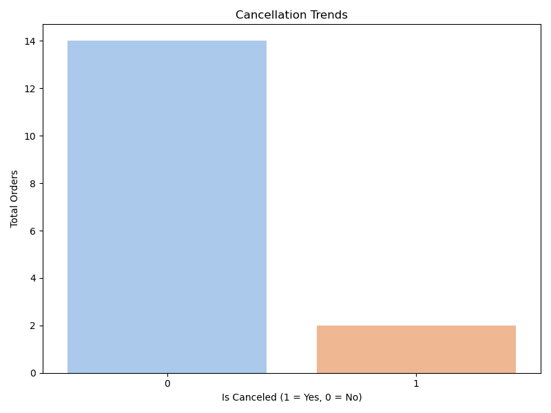

# 📊 Culinary Insights & Order Trend Analytics


## 🎯 Objective

This project analyzes user behavior, cooking preferences, and order trends to derive actionable business insights. By merging and exploring complex datasets, we identify key drivers of user engagement and potential areas for revenue optimization.

**Key Focus Areas:**
- 🧹 **Data Cleaning:** Robust handling of missing values, inconsistent naming, and data merging from multiple sources.
- 📈 **Trend Analysis:** Investigating the correlation between cooking sessions and order placements.
- 👥 **Demographics:** Understanding how age and location influence culinary preferences.
- 🚫 **Optimization:** Analyzing cancellation trends to improve service reliability.

---

## 📂 Project Structure

The codebase is modular and organized for scalability:

```
Data Analytics Assignment/
├── Data/                       # Raw and processed datasets
│   ├── Cleaned_Merged_Dataset.xlsx
│   └── Data Analyst Intern Assignment - Excel.xlsx
├── Scripts/                    # Python source code
│   ├── analysis.py             # core logic for statistical analysis
│   ├── data_cleaning.py        # data ingestion and sanitization pipeline
│   ├── visualizations.py       # plotting library for generating charts
│   └── main.py                 # execution entry point
├── Visualizations/             # Generated high-resolution charts
│   ├── top_10_dishes.png
│   ├── age_distribution.png
│   ├── favorite_meal_analysis.png
│   └── cancellation_trends.png
├── requirements.txt            # Project dependencies
└── README.md                   # Project documentation
```

---

## 🚀 Execution

### Prerequisites
* Python 3.8 or higher
* Pip package manager

### Installation
1. Clone the repository:
   ```bash
   git clone https://github.com/AnkithGoje/DataAnalyticsAssignment.git
   ```
2. Install dependencies:
   ```bash
   pip install -r requirements.txt
   ```

### Running the Analysis
Execute the main script to process the data and generate reports:
```bash
python Scripts/main.py
```

All generated visualizations will be saved to the `Visualizations/` folder, and the cleaned dataset will be stored in `Data/`.

---

## 📊 Visual Insights

### 1. Top Popular Dishes
*Identifies high-performing menu items based on **valid** (non-canceled) order volumes.*


### 2. User Demographics
*Breakdown of user base by age group to target marketing campaigns effectively.*


### 3. Favorite Meal Preferences
*Analysis of preferred meal types (Breakfast, Lunch, Dinner) based on order frequency.*


### 4. Cancellation Trends
*Overview of order success rates to identify potential operational bottlenecks.*


---

## 💡 Key Findings

*   **Most Popular Dish:** **Spaghetti** leads the menu with the highest number of successful orders.
*   **Target Demographic:** Users in the **25-35 age group** are the most active segment.
*   **Meal Preference:** **Dinner** is the peak time for orders, suggesting a demand for evening meal solutions.

---

## 📞 Contact

For questions or collaboration opportunities, please reach out:

*   **Name:** Ankith Goje
*   **Email:** [ankithgoje25@gmail.com](mailto:ankithgoje25@gmail.com)
*   **Phone:** +91-8498866536

